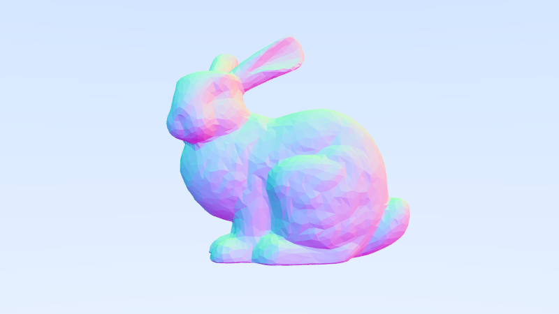

# Ray-Tracing

This project renders 3D scenes using ray tracing techniques, including spheres, triangle meshes, materials, lighting behavior, camera setup, and image output. It supports loading OBJ meshes and implements a BVH (Bounding Volume Hierarchy) acceleration structure for efficient ray-object intersection. The render loop is parallelized with OpenMP, making it practical to render scenes with hundreds of objects and complex geometry.

## Preview



## Features
- CPU path tracer supporting diffuse, metallic, and dielectric materials
- Triangle mesh rendering with OBJ loading
- BVH acceleration structure for efficient ray traversal
- Thin-lens camera model with depth of field
- Monte Carlo sampling for anti-aliasing and material scattering
- OpenMP-based parallel rendering

## Build and Run

This project uses CMake and requires a C++17 compiler with OpenMP support (any modern GCC, Clang, or MSVC).

### Build

```bash
cmake -S . -B build
cmake --build build
```

This produces an optimized (-O3) executable at build/raytracer. CMake defaults to a Release build.

### Run

```bash
./build/raytracer > image.ppm
```

## Performance

Final scene (1200×675, 500 samples per pixel, max depth 50) on an Intel Core Ultra 9 275HX (24 cores, WSL2):

| Build               | Time     |
| ------------------- | -------- |
| Single-threaded     | ~4m 25s  |
| OpenMP (24 threads) | ~1m 3s  |

## References

- [Ray Tracing in One Weekend](https://raytracing.github.io/books/RayTracingInOneWeekend.html) by Peter Shirley 
- [Stanford Bunny mesh](https://graphics.stanford.edu/~mdfisher/Data/Meshes/bunny.obj)

## Future Work

- Volumetric rendering for clouds, fog, and participating media
- CUDA-based GPU ray marching and parallel acceleration
- Signed Distance Function (SDF) rendering 