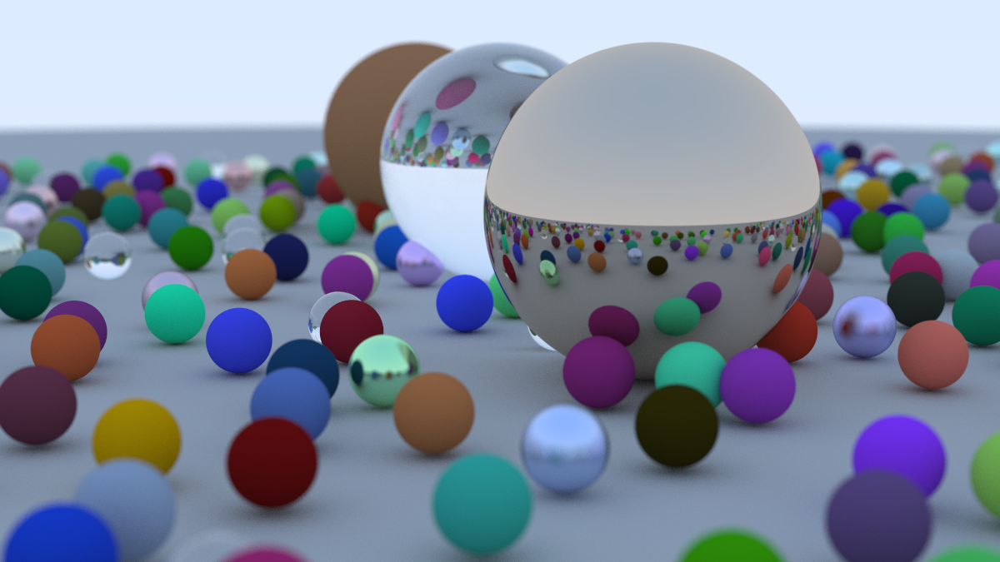

# Ray-Tracing

A simple ray tracer implemented while following the **Ray Tracing in One Weekend** tutorial series.

This project renders a basic 3D scene using ray tracing techniques, including rays, spheres, materials, lighting behavior, camera setup, and image output.

## Preview



## Features

- Basic ray generation
- Sphere intersection
- Surface normals
- Anti-aliasing
- Diffuse (Lambertian) materials
- Metal materials with fuzz
- Dielectric / glass materials
- Positionable camera with depth of field
- PPM image output

## Build and Run

Compile:

```bash
g++ -std=c++17 -O3 -march=native main.cpp -o raytracer
```

Run and save the rendered image:

```bash
./raytracer > image.ppm
```

## Reference

- [Ray Tracing in One Weekend](https://raytracing.github.io/books/RayTracingInOneWeekend.html) by Peter Shirley

## Roadmap

Following *Ray Tracing: The Next Week*:

- [ ] BVH acceleration